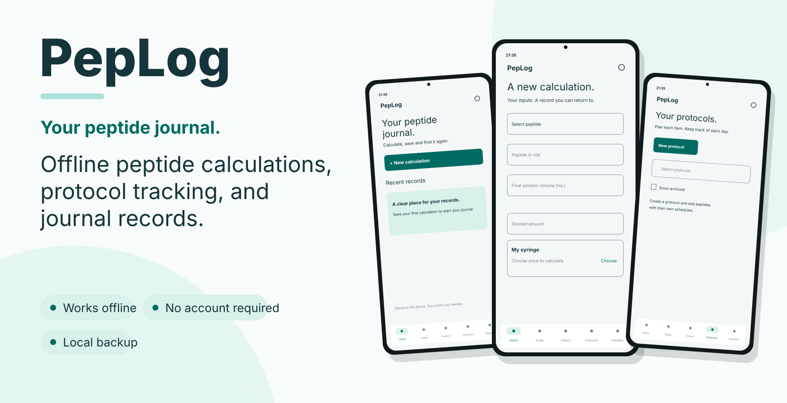
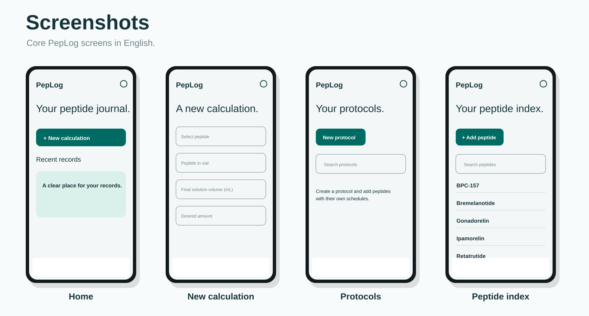

# PepLog

[](LICENSE)

<p align="center">
  
</p>

An offline Android app for peptide calculations, blend composition, and protocol tracking. Keep your calculations, schedules, and daily records together on your device.

## Features

- **Peptide and blend calculations:** calculate volume and syringe units using mg or mcg, with a breakdown for each blend component.
- **Syringe selection:** choose capacity and graduation or configure a custom scale.
- **Calculation history:** save, search, filter by date, edit, and reuse calculations.
- **Protocol tracking:** plan dates, weekdays, and times; record completed or skipped occurrences from Today or the monthly calendar.
- **Protocol management:** delete unused protocols or archive protocols while preserving their history.
- **Local reminders:** optional Android notifications for scheduled occurrences.
- **Backup and restore:** export and restore your data as a JSON file.
- **Two languages:** English and Brazilian Portuguese.

No account or server is required. The app works offline and does not request internet access. The catalog identifies compounds; it does not recommend doses or assess suitability. Calculated vial yield is theoretical and excludes losses.

## Screenshots

<p align="center">
  
</p>

## Download version 0.6.5

**[Download PepLog for Android](https://github.com/marraqy/PepLog/releases/download/v0.6.5/PepLog-0.6.5.apk)**

Requires **Android 8.0 or later**. Download `PepLog-0.6.5.apk`, open it on your phone, and follow the Android installation prompts. See [installation instructions](INSTALAR.md) or the [release page](https://github.com/marraqy/PepLog/releases/tag/v0.6.5).

To update an existing installation, export a backup first and install over the current app without uninstalling it.

## Support PepLog

If PepLog is useful to you, consider supporting its development. Contributions are optional and help support maintenance and future improvements.

You can contribute **USDC** on either of these networks:

| Network | Receiving address |
| --- | --- |
| **Solana** | `J9ZWgHB5PLpvteLqqeHRXou9h2RVqRDuezw4AE3iLA1W` |
| **Ethereum (mainnet)** | `0x83Ee07EEcD21AFa856E187414ba12e304Cf8c218` |

Select **USDC** and the matching network before sending. The Ethereum option is for Ethereum mainnet, not Base or another network. Network and withdrawal fees may apply.

Thank you for supporting PepLog!

## Your data

Records are stored locally on your device. Android automatic backup is disabled, so export a backup before uninstalling the app or changing devices. JSON backups include your catalog, calculations, protocols, and occurrence records. They are not encrypted. Restore validates the file and asks for confirmation before replacing current data.

Reminder delivery depends on Android permissions, alarm access, notification settings, and device battery restrictions.

## Build from source

Built with **Kotlin**, **Jetpack Compose**, and **Room**.

Requirements: JDK 17, Android SDK platform 35, and build-tools 35.0.0. Set `JAVA_HOME` to the JDK and `ANDROID_HOME` to the SDK, or specify `sdk.dir` in an untracked `local.properties` file.

On Windows, from the repository root:

```powershell
.\gradlew.bat testDebugUnitTest lintDebug assembleDebug
```

On Linux or macOS:

```sh
sh ./gradlew testDebugUnitTest lintDebug assembleDebug
```

The wrapper downloads Gradle 8.11.1. The first build requires internet access for tools and dependencies.

Debug APK: `app/build/outputs/apk/debug/app-debug.apk`. Debug builds use a different signing key; use a separate emulator or device for development.

For a release build, run `assembleRelease` instead. Without local signing configuration, the output is unsigned. Signing keys and passwords are excluded from this repository. The application ID is `app.peptides.journal`.

The `build.ps1` script targets the maintainer's local `.tools/` setup. Use the Gradle wrapper commands above for a fresh clone.

## License

PepLog is licensed under the **Apache License 2.0**. See [LICENSE](LICENSE) for details.
