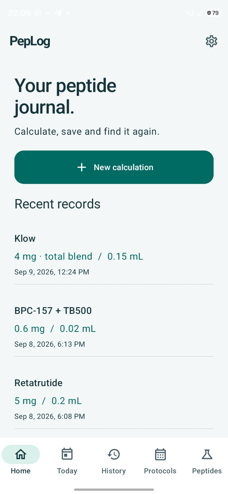
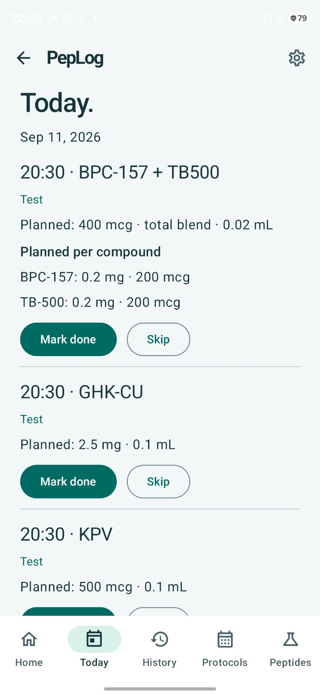
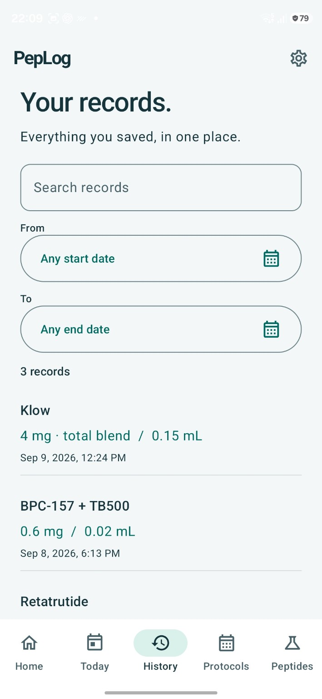
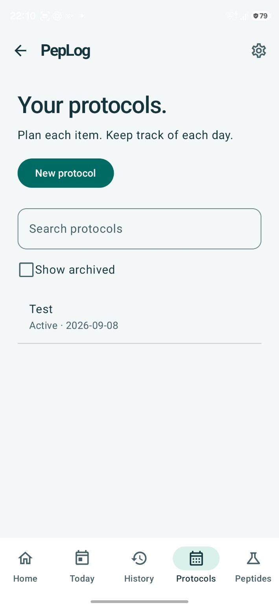
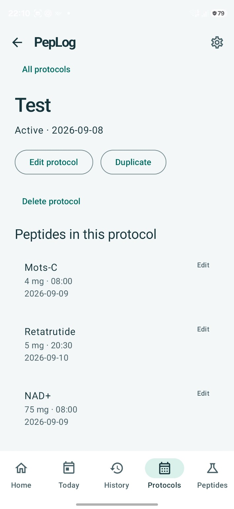
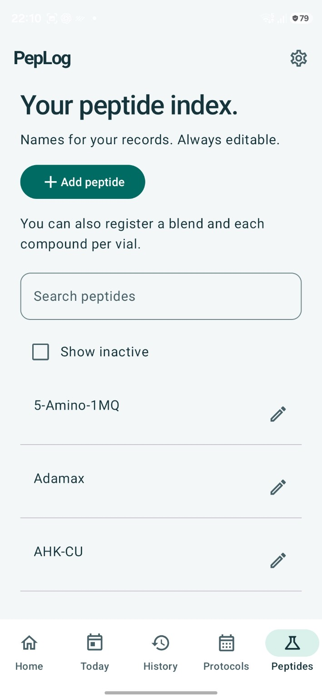
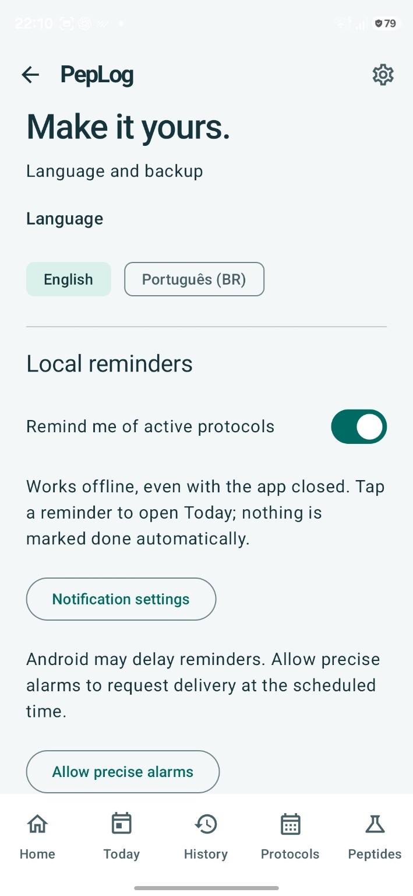

# PepLog screenshots

[← Back to PepLog](../README.md#screenshots)

[Home](#home) · [Today](#today) · [History](#history) · [Protocols](#protocols) · [Protocol detail](#protocol-detail) · [Peptides](#peptides) · [Settings](#settings)

Original Android captures, 709 × 1536 pixels. Select an image to open the full-size JPG; use your browser's zoom to inspect details.

## Home

Start a calculation or reopen a recent record.

  

[Open original](https://raw.githubusercontent.com/marraqy/PepLog/main/docs/images/screens/home.jpg) · [Back to top](#peplog-screenshots) · [Today →](#today)

## Today

See scheduled items and record completed or skipped occurrences.

  

[Open original](https://raw.githubusercontent.com/marraqy/PepLog/main/docs/images/screens/today.jpg) · [← Home](#home) · [Back to top](#peplog-screenshots) · [History →](#history)

## History

Search saved calculations and filter by date.

  

[Open original](https://raw.githubusercontent.com/marraqy/PepLog/main/docs/images/screens/history.jpg) · [← Today](#today) · [Back to top](#peplog-screenshots) · [Protocols →](#protocols)

## Protocols

Create, find, and archive protocols.

  

[Open original](https://raw.githubusercontent.com/marraqy/PepLog/main/docs/images/screens/protocols.jpg) · [← History](#history) · [Back to top](#peplog-screenshots) · [Protocol detail →](#protocol-detail)

## Protocol detail

Review the compounds and schedule within a protocol.

  

[Open original](https://raw.githubusercontent.com/marraqy/PepLog/main/docs/images/screens/protocol-detail.jpg) · [← Protocols](#protocols) · [Back to top](#peplog-screenshots) · [Peptides →](#peptides)

## Peptides

Browse and maintain the peptide and blend catalog.

  

[Open original](https://raw.githubusercontent.com/marraqy/PepLog/main/docs/images/screens/peptides.jpg) · [← Protocol detail](#protocol-detail) · [Back to top](#peplog-screenshots) · [Settings →](#settings)

## Settings

Choose a language and manage reminders and backups.

  

[Open original](https://raw.githubusercontent.com/marraqy/PepLog/main/docs/images/screens/settings.jpg) · [← Peptides](#peptides) · [Back to top](#peplog-screenshots)

